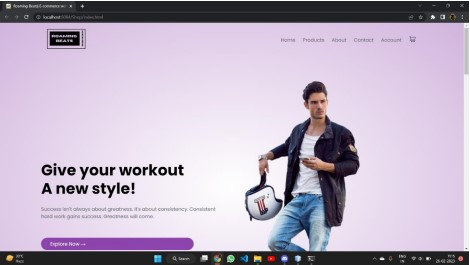
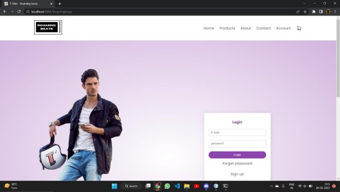
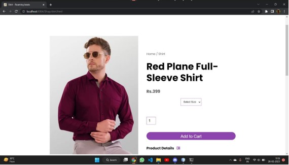
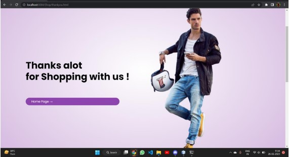

# Roaming Beats - E-commerce Website

**Roaming Beats** is an educational Java-based e-commerce platform designed for purchasing apparel with a clean, interactive GUI.  
Users can browse, compare, and purchase products easily, with features like cart management and secure login.

---

## 📌 Features
- **User-friendly GUI**
- Browse and search products
- Price, size, and pattern comparison
- User registration & login
- Cart management & checkout
- Works on web & HTTP-enabled devices

---

## 🛠 Technologies Used
**Server:**
- Apache Tomcat (Web Server)
- Oracle Database Server

**Languages/Frameworks:**
- Java Servlets
- JSP
- HTML
- JDBC

**Architecture:**
- Model-View-Controller (MVC)

---

## 📂 Database Structure
**Account Details Table (t80)**  
ENAME (VARCHAR) - User Name
EEMAIL (VARCHAR) - Email Address
EPASS (VARCHAR) - Password
ESECQ (VARCHAR) - Security Question
EANS (VARCHAR) - Answer
EADD (VARCHAR) - Address
ECNO (VARCHAR) - Contact Number

**Product Details Table (t81)**  
PNAME (VARCHAR) - Product Name
QUAN (NUMBER) - Quantity
PRICE (NUMBER) - Price

---

## 🚀 Future Scope
- Payment Gateway Integration
- AJAX for one-click operations
- Better database modularity
- Client-side validation improvements

---

## 📷 Screenshots  

### 🏠 Home Page

### 🔑 Login Page

### 🛍 All Products

### 👕 Product Details

### ✅ Thank You Screen

---

## 📖 How to Run
1. Clone this repository.
2. Import into an IDE (Eclipse/NetBeans).
3. Configure Apache Tomcat and Oracle Database.
4. Deploy to Tomcat.
5. Run in your browser:  
http://localhost:8084/Shop

---

**Developed by:**  
Somnath Maji
